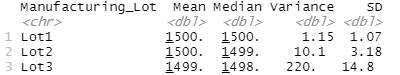

# MechaCarChallenge

There are two data sets for this challenge.  The first dataset which has 50 prototypes of cars that contain the following information
* Vehicle Length
* Vehicle Weight
* Spoiler Angle
* Ground Clearance
* AWD
* mpg

A statistical analysis has been made to determine the impact of the variables on the mileage.  A linear model was created to check which of the variables have the most impact.  It has been found that the Ground Clearance and the Vehicle Length have more impact are statistically unlikely to provide random amounts of variance to the linear model.  Further, the slope of the scatter plot further proves this relationship.

The second dataset is of manufacturing information of vehicle suspension coils from three lots.  A t-test has been performed on the lots which indicate that the mean psi of the lots is 1500 psi however, LOT3 has a variance of over 100 psi on its suspension coils.

